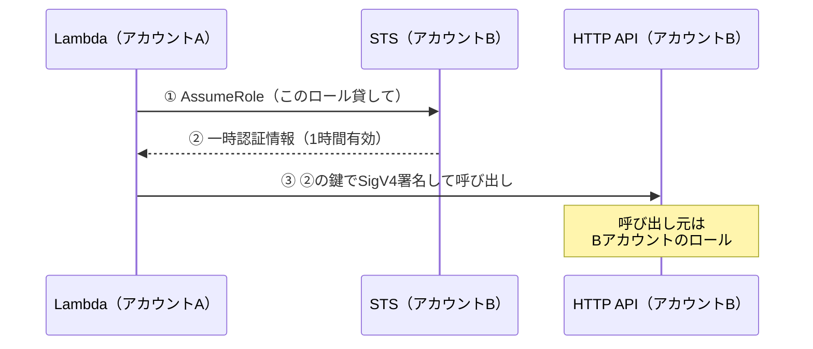
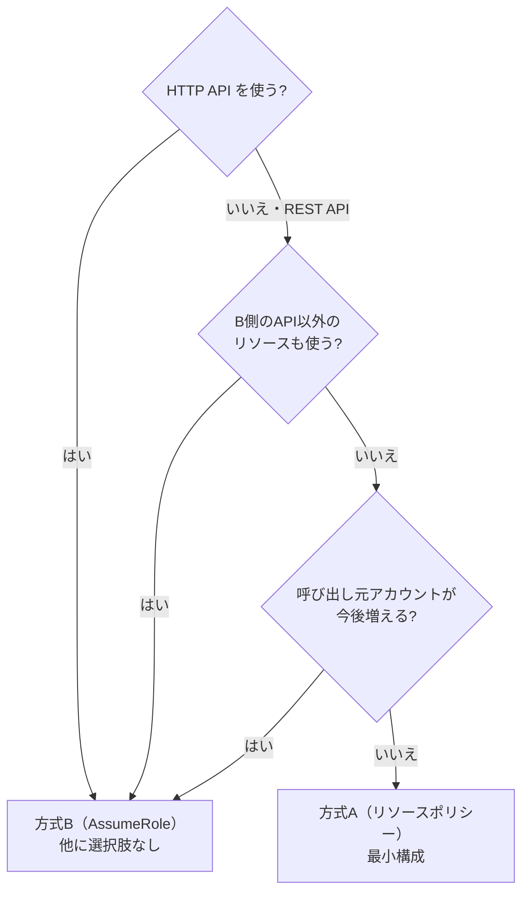

## はじめに

「アカウント A の Lambda から、アカウント B の API Gateway を呼びたい」

マルチアカウント構成では珍しくない要件ですが、素直にやると **403 を延々と踏み続ける**ことになります。しかも厄介なことに、エラーメッセージを見ても「何が足りないのか」がわかりにくい。

この記事では、実際に 2 つの方式を AWS SAM で組んで動かした結果をまとめます。**AWS 歴が浅い方でも追えるように、前提知識は都度おさらいを挟みます。**

### 先に結論

判断を決めているのは、AWS 側の仕様 2 つだけです。

| # | ルール | 効いてくる場面 |
|---|---|---|
| 1 | **クロスアカウントでは「呼ぶ側」と「呼ばれる側」の両方で明示的に許可**しないと通らない | 403 が消えない原因のほぼ全部 |
| 2 | **HTTP API はリソースポリシーに対応していない** | 方式の選択肢がここで消える |

この 2 つから、次のように決まります。

- **REST API** で呼び出し元が固定 → **方式A（リソースポリシー）**
- **HTTP API** → **方式B（AssumeRole）一択**。仕様上ほかに手段がない

---

## 0. 前提知識のおさらい

知っている方は読み飛ばしてください。折りたたんであります。

:::details そもそもなぜ AWS アカウントを分けるのか

1 つのアカウントに全部入れると、権限・課金・障害の影響範囲がすべて混ざります。これを分けるために、AWS では**アカウント自体を分割単位として使う**のが一般的です。

- 本番 / ステージング / 開発
- チームやプロダクト単位

分けると安全になる代わりに、「**アカウントをまたいでアクセスしたい**」という要件が必ず出てきます。今回のテーマはまさにそれです。
:::

:::details IAM ポリシーって結局なに？

**「誰が・何を・どれに・どんな条件で」を書いた JSON** です。

```json
{
  "Effect": "Allow",
  "Action": "execute-api:Invoke",
  "Resource": "arn:aws:execute-api:ap-northeast-1:222222222222:abc123/prod/POST/items"
}
```

ここで最重要なのが、**AWS のデフォルトは「全部拒否」**だということ。何も書かなければ何もできません。「書いたものだけが許可される」と覚えてください。

そしてポリシーには**貼る場所が 2 種類**あります。この区別が今回の話の中心です。

| 種類 | 貼る場所 | 答える問い |
|---|---|---|
| **アイデンティティベースポリシー** | 人・ロールなど「主体」側 | この人は何ができるか |
| **リソースベースポリシー** | S3 バケットや API など「リソース」側 | このリソースは誰に使わせるか |

見分け方は簡単で、**JSON に `"Principal"`（誰が）が書いてあればリソース側**です。主体側に貼るポリシーは、貼った相手自身が「誰が」なので `Principal` を書きません。
:::

:::details IAM ロールって結局なに？

**一時的に borrow（借用）できる権限のセット**です。

IAM ユーザーのアクセスキーは有効期限がなく、漏れたら気づいて無効化するまで悪用され続けます。一方ロールは、借りるたびに**有効期限つき（既定 1 時間）の一時的な鍵**が発行されるので、漏れても被害が時間で切れます。

Lambda も例外ではなく、**起動時に「実行ロール」を借りて動いています**。だから Lambda のコードにアクセスキーを書く必要がないわけです。

そしてロールには、性質の違うポリシーが 2 つ付きます。ここは後半で重要になります。

| ポリシー | 答える問い |
|---|---|
| **信頼ポリシー** | **誰が**このロールを借りられるか |
| **権限ポリシー** | 借りた後に**何ができる**か |
:::

:::details SigV4 署名って結局なに？

AWS への HTTP リクエストに**署名を付ける仕組み**です。

パスワードのようにシークレットキーをそのまま送るのではなく、**シークレットキーを鍵にして「リクエストの中身」を計算した結果**を送ります。AWS 側が同じ計算を再現して一致すれば本人と認める、という方式です。

これにより 3 つが同時に成立します。

- **認証**: 鍵を知っている人しか正しい署名を作れない
- **改ざん検知**: URL やボディを 1 バイト変えると署名が合わなくなる
- **リプレイ抑止**: 署名に時刻が入っていて、5 分程度のずれしか許容されない

API Gateway で「**IAM 認証**」を有効にするというのは、要するに「**このリクエストは SigV4 で署名されていること**」を要求する設定です。

普段 AWS CLI や SDK を使っているときは自動でやってくれているので意識しませんが、**自作の API Gateway には SDK のクライアントが存在しない**ため、今回は自分で署名します。
:::

---

## 1. やりたいこと

```
┌─ アカウントA ─────────┐        ┌─ アカウントB ─────────┐
│                       │        │                       │
│   Lambda ─────────────┼───?───▶│   API Gateway         │
│                       │        │                       │
└───────────────────────┘        └───────────────────────┘
```

一見ただの HTTPS リクエストですが、**アカウントの壁を越える**ぶんだけルールが増えます。

---

## 2. つまずきポイント① クロスアカウントは「両側の許可」が必要

ここが最大の罠です。**同一アカウント内かクロスアカウントかで、必要な条件が変わります。**

```
【同一アカウント】どちらか一方の許可でOK（OR）

  アイデンティティポリシー ─┐
                           ├─▶ どちらかが Allow なら通る
  リソースポリシー ─────────┘


【クロスアカウント】両方の許可が必要（AND）

  A側のアイデンティティポリシー ─┐
                                 ├─▶ 両方が Allow でないと拒否
  B側のリソースポリシー ─────────┘
```

公式ドキュメントにもはっきり書かれています。

> If the caller and API owner are from separate accounts, both the IAM policies and the resource policy explicitly allow the caller to proceed.
> — [How API Gateway resource policies affect authorization workflow](https://docs.aws.amazon.com/apigateway/latest/developerguide/apigateway-authorization-flow.html)

:::message alert
**「A 側に権限を付けたのに 403 が消えない」の原因はほぼこれです。**
同一アカウントでの経験があると「片方書けば通る」と思い込みがちですが、クロスアカウントでは通用しません。
:::

### なぜ AND なのか

意地悪な仕様に見えますが、理由は明快です。**2 つのアカウントの管理者が、独立に同意する必要があるから**。

- B の管理者が勝手に「A の誰でもどうぞ」と決めても、A の管理者が許可しなければ A のリソースは動かない
- A の管理者が勝手に「B の API を呼ぶ」と書いても、B の管理者が許可しなければ通らない

つまり **AND は「片方のアカウントが単独でアカウントの壁を越えられない」という保証**になっています。同一アカウント内なら管理者は 1 人なので、どちらかに書けば意思表示として十分、という設計です。

---

## 3. つまずきポイント② HTTP API はリソースポリシーが使えない

API Gateway には **REST API** と **HTTP API** の 2 種類があります。

:::message
名前が紛らわしいのですが、**HTTP API は REST API の後継ではありません**。「REST API から機能を削って安く・速くしたもの」で、両者は併存しています。
:::

そして HTTP API には、こういう制約があります。

> Resource policies aren't currently supported for HTTP APIs.
> — [Control access to HTTP APIs with IAM authorization](https://docs.aws.amazon.com/apigateway/latest/developerguide/http-api-access-control-iam.html)

**ルール①と組み合わせると、詰みます。**

```
HTTP API ではB側にリソースポリシーを置けない
        ＋
クロスアカウントには両側の許可が要る
        ↓
呼び出し元の身元を「Bアカウントの中の人」にするしかない
        ↓
AssumeRole が必須（＝方式B）
```

これが方式B を選ぶ、最大かつ現実的な理由です。

---

## 4. 方式A：リソースポリシー方式（REST API）

まずはシンプルな方から。**Lambda が自分の実行ロールのまま、直接 API を叩きます。**

```
┌─ アカウントA ──────────┐     ┌─ アカウントB ─────────────┐
│                        │     │                           │
│  Lambda 実行ロール     │     │  REST API (IAM認証)       │
│   └ execute-api:Invoke ┼──①─▶│   リソースポリシー        │
│         【許可その1】  │SigV4│    Principal: Aのロール ②│
│                        │     │         【許可その2】     │
└────────────────────────┘     └───────────────────────────┘

   ①と②の【両方】が必要（ルール①）
```

### B 側（API を提供する側）

```yaml:template.yaml（アカウントB）
CrossAccountApi:
  Type: AWS::Serverless::Api
  Properties:
    StageName: prod
    Auth:
      DefaultAuthorizer: AWS_IAM      # SigV4署名を必須にする
      ResourcePolicy:
        CustomStatements:
          - Effect: Allow
            Principal:
              AWS: !Ref CallerRoleArn  # ← A側のロールARN
            Action: execute-api:Invoke
            Resource:
              - execute-api:/prod/POST/items
```

:::message
`Resource` の `execute-api:/prod/POST/items` は**簡略構文**です。保存時に API Gateway がリージョン・アカウントID・API ID を補って完全な ARN に展開してくれます。
:::

### A 側（呼び出す側）

```yaml:template.yaml（アカウントA）
Policies:
  - Statement:
      - Effect: Allow
        Action: execute-api:Invoke
        Resource: arn:aws:execute-api:ap-northeast-1:222222222222:abc123/prod/POST/items
```

:::message alert
この ARN のアカウントID は **API を持っている B 側**です。呼び出し元の A ではありません。ここを間違えるのは定番のミスです。
:::

### Lambda のコード

```python:app.py
import json, os, boto3, urllib3
from botocore.auth import SigV4Auth
from botocore.awsrequest import AWSRequest

API_ENDPOINT = os.environ["API_ENDPOINT"]
API_REGION = os.environ["API_REGION"]

_http = urllib3.PoolManager()
_credentials = boto3.Session().get_credentials()

def handler(event, context):
    body = json.dumps({"message": "hello from account A"})

    request = AWSRequest(method="POST", url=API_ENDPOINT, data=body,
                         headers={"Content-Type": "application/json"})
    # サービス名は execute-api 固定。リージョンは【B側APIのリージョン】
    SigV4Auth(_credentials.get_frozen_credentials(), "execute-api", API_REGION).add_auth(request)

    resp = _http.request("POST", API_ENDPOINT, body=body, headers=dict(request.headers))
    return {"statusCode": resp.status, "response": json.loads(resp.data)}
```

:::message
`boto3` / `botocore` / `urllib3` はすべて **Lambda の Python ランタイムに同梱**されています。追加パッケージのバンドルは不要です。
:::

### 動かすとこうなる

B 側の Lambda で「誰が呼んできたか」を返すようにしておくと、こう見えます。

```json
{
  "caller": {
    "accountId": "111111111111",
    "userArn": "arn:aws:sts::111111111111:assumed-role/CallerFunctionRole/..."
  }
}
```

**アカウント A のロールがそのまま届いています。** B 側のログを見るだけで「A のどのロールが呼んだか」がわかるのは、この方式の大きな利点です。

:::details なぜ userArn が `iam` じゃなくて `sts`／`assumed-role` なの？
ポリシーに書くのは `arn:aws:iam::111111111111:role/MyRole`（ロール本体）ですが、実際にリクエストを出すのは「そのロールを借りた一時的なセッション」なので、ログには `arn:aws:sts::111111111111:assumed-role/MyRole/セッション名` が出ます。

**ポリシーには必ず前者（`iam` / `role/`）を書いてください。** ログで見た `assumed-role` 形式をコピペしても一致せず、403 になります。
:::

---

## 5. 方式B：AssumeRole 方式（HTTP API）

こちらは **「まず B のロールを借りてから、B の中の人として API を叩く」** 方式です。



### B 側：借りられるロールを用意する

ロールに**性質の違う 2 つのポリシー**を付けます。ここを混同しやすいので表で整理します。

| ポリシー | 答える問い | 中身 |
|---|---|---|
| 信頼ポリシー | **誰が**借りられるか | A の Lambda 実行ロール |
| 権限ポリシー | 借りた後**何ができる**か | この API への `execute-api:Invoke` |

```yaml:template.yaml（アカウントB）
CrossAccountHttpApi:
  Type: AWS::Serverless::HttpApi
  Properties:
    StageName: prod
    Auth:
      EnableIamAuthorizer: true     # HTTP APIではこの2行がセット
      DefaultAuthorizer: AWS_IAM

ApiCallerRole:
  Type: AWS::IAM::Role
  Properties:
    # 【信頼ポリシー】誰が借りられるか
    AssumeRolePolicyDocument:
      Version: '2012-10-17'
      Statement:
        - Effect: Allow
          Principal:
            AWS: !Ref CallerRoleArn      # ← A側のロールARN
          Action: sts:AssumeRole
    # 【権限ポリシー】借りた後に何ができるか
    Policies:
      - PolicyName: InvokeHttpApi
        PolicyDocument:
          Version: '2012-10-17'
          Statement:
            - Effect: Allow
              Action: execute-api:Invoke
              Resource: !Sub "arn:aws:execute-api:${AWS::Region}:${AWS::AccountId}:${CrossAccountHttpApi}/prod/POST/items"
```

:::message alert
**片方だけでは動きません。**
- 信頼ポリシーだけ → 借りられるが、API を呼ぶ権限がない
- 権限ポリシーだけ → そもそも借りられない（`AccessDenied`）
:::

### A 側：必要な権限は 1 つだけ

```yaml:template.yaml（アカウントA）
Policies:
  - Statement:
      - Effect: Allow
        Action: sts:AssumeRole          # これだけ
        Resource: arn:aws:iam::222222222222:role/ApiCallerRole
```

方式A と違い、**A 側に API の権限を書く必要がありません**。API を呼ぶ権限は B 側のロールが持っているからです。

### Lambda のコード

```python:app.py
import time, boto3
from botocore.credentials import Credentials

_sts = boto3.client("sts")
_cache = {"credentials": None, "expires_at": 0.0}

def _assumed_credentials(request_id, function_name):
    # 一時認証情報は1時間有効。期限まで使い回す
    if _cache["credentials"] and time.time() < _cache["expires_at"] - 300:
        return _cache["credentials"], True

    # RoleSessionName は追跡の唯一の手がかり。意味のある値を入れる
    session_name = f"{function_name}-{request_id[:8]}"[:64]
    r = _sts.assume_role(RoleArn=ASSUME_ROLE_ARN,
                         RoleSessionName=session_name,
                         DurationSeconds=3600)["Credentials"]

    _cache["credentials"] = Credentials(
        access_key=r["AccessKeyId"],
        secret_key=r["SecretAccessKey"],
        token=r["SessionToken"],       # 一時認証情報にはトークンが付く
    )
    _cache["expires_at"] = r["Expiration"].timestamp()
    return _cache["credentials"], False
```

署名部分は**方式A とまったく同じコード**です。渡す認証情報が違うだけ。

```python
SigV4Auth(credentials, "execute-api", API_REGION).add_auth(request)
```

:::message
一時認証情報にはセッショントークンが含まれますが、`SigV4Auth` が `X-Amz-Security-Token` ヘッダーを自動で付けてくれます。だから署名コードを分岐させる必要がありません。
:::

:::message alert
**毎回 AssumeRole しないこと。** STS 呼び出しは数十〜百 ms かかり、全リクエストの応答時間に乗ります。Lambda はコンテナを再利用するので、ハンドラ関数の**外**の変数に置くだけでウォームスタート間で使い回せます。

期限ぎりぎりまで使うと「取得時は有効だったが到達時には切れていた」が起きるので、**数分のマージンを引いて**取り直します（上記の `- 300`）。
:::

### 動かすとこうなる

```json
{
  "caller": {
    "accountId": "222222222222",
    "userArn": "arn:aws:sts::222222222222:assumed-role/ApiCallerRole/xacct-b-caller-1a2b3c4d"
  }
}
```

**方式A と決定的に違います。** `accountId` が **B** になっている。API から見た呼び出し元は B 自身のロールなのです。

### なぜこれでリソースポリシーが要らないのか

図にすると一目瞭然です。

```
【方式A】身元がアカウントの壁を越える
  Aのロール ─────────(壁)─────────▶ BのAPI
  → クロスアカウント判定 → 両側の許可が必要 → リソースポリシー必須

【方式B】身元は壁を越えない
  Aのロール ──AssumeRole──▶ Bのロール ──▶ BのAPI
                            └─ ここから先はB内部の話 ─┘
  → 同一アカウント判定 → B側ロールの権限だけでOK → リソースポリシー不要
```

**「壁を越える部分を `execute-api` から `sts:AssumeRole` に付け替えている」** と捉えると理解しやすいと思います。壁を越える箇所では当然ルール①が適用されるので、AssumeRole には A 側の権限と B 側の信頼ポリシーの両方が必要です。

:::message alert
**トレードオフ**：API に届くのが B 側のロールになるため、**「A 側の誰が呼んだか」が API のログからは直接わかりません。**

追跡手段は 2 つだけです。
1. `RoleSessionName`（`userArn` の末尾に出る）
2. B アカウントの CloudTrail の `AssumeRole` イベント

だから `RoleSessionName` を `session` みたいな無意味な値にすると、後で追えなくなります。
:::

:::details 実は方式A も裏で AssumeRole している

方式A の `userArn` をよく見ると `assumed-role` 形式でした。明示的に AssumeRole していないのに、です。

これは **Lambda サービスが関数の起動時に実行ロールを借りている**ためです。つまり両方式の違いは「AssumeRole するかどうか」ではなく、**「AssumeRole を 1 回で済ませるか、2 回連ねるか」**です。

```
方式A: Lambdaサービス ──借用──▶ Aの実行ロール ──▶ BのAPI
方式B: Lambdaサービス ──借用──▶ Aの実行ロール ──借用──▶ Bのロール ──▶ BのAPI
                                                ^^^^^^ ここを足しただけ
```

この見方をすると、方式B で一時認証情報の有効期間が最大 1 時間に制限される理由（ロールを連ねる「ロールチェーン」の制約）も自然に理解できます。
:::

---

## 6. 結局どっちを使えばいい？

### 比較表

| 観点 | 方式A（リソースポリシー） | 方式B（AssumeRole） |
|---|---|---|
| REST API | ◎ | ◎ |
| **HTTP API** | **✗ 使えない** | ◎ |
| 実装の単純さ | ◎ STS 呼び出し不要 | △ キャッシュ処理が要る |
| レイテンシ | ◎ | △（キャッシュすれば ◎） |
| 権限の管理場所 | △ 両アカウントに分散 | ◎ B 側に集約 |
| 呼び出し元の追跡 | ◎ A のロールが届く | △ CloudTrail との突合が必要 |
| 呼び出し元の追加 | △ ポリシー変更＋API再デプロイ | ◎ 信頼ポリシー変更のみ |
| API 以外への横展開 | ✗ | ◎ 同じロールに権限を足すだけ |

### 選び方



**迷ったら方式B** でいいと思います。運用面（呼び出し元の増減、API 以外への横展開）で効いてきますし、レイテンシの不利はキャッシュでほぼ消えるためです。

---

## 7. ハマったときのチェックリスト

実際に踏んだものを中心に。

### `is not authorized to perform: execute-api:Invoke`

**ルール①の違反がほぼ確定**です。

- [ ] B 側リソースポリシーの `Principal` が A の**ロール ARN**（`iam` / `role/`）になっているか
- [ ] A 側ポリシーの `Resource` ARN のアカウントID が **B 側**になっているか
- [ ] ステージ名・メソッド・パスが両側で一致しているか
- [ ] **リソースポリシー変更後に API を再デプロイしたか**（後述）

### 403 が消えない → リソースポリシーの再デプロイ忘れ

:::message alert
**REST API のリソースポリシーは、変更しただけでは反映されません。** ステージへのデプロイが必要です。マネコンで直接編集したときに特にハマります。

```bash
aws apigateway create-deployment --rest-api-id <API_ID> --stage-name prod
```

ちなみに **HTTP API は自動デプロイ**なので、この問題は起きません。
:::

### `{"message":"Missing Authentication Token"}`

**認証情報がない、という意味ではありません。** ほとんどの場合、**そのパス/メソッドのルートが存在しない**だけです。まず URL を疑ってください（ステージ名の付け忘れが多い）。

HTTP API の場合は同じ状況で `{"message":"Forbidden"}` が返ります。

### `MalformedPolicyDocument: Invalid principal in policy`

IAM ロールの**信頼ポリシーに、実在しないロール ARN を書いています**。IAM は信頼ポリシーの principal が実在するかを検証するためです。

方式B で「B のスタックを先に作ろう」とすると必ずこれになります。**A 側（＝ Lambda 実行ロール）を先に作ってください。**

:::message
クロスアカウント構成には**循環参照**があります。
- B 側のポリシーは「A のロール ARN」を知る必要がある
- A 側の Lambda は「B のエンドポイント」を知る必要がある

なので `A → B → A（再デプロイ）` の 3 ステップに分けるのが定石です。
:::

### ロールを作り直したら急に 403 になった

ポリシーに書いたロール ARN は、保存時に内部の一意ID（`AROA...`）に変換されて保持されます。**同名で作り直すと ID が変わり、参照している側のポリシーが壊れます。**

ポリシーの JSON を見て `Principal` が ARN ではなく `AROAXXXX...` になっていたらこれです。参照側のポリシーを保存し直せば直ります。

### `SignatureDoesNotMatch`

これは**認可ではなく署名の失敗**です。切り分けが重要なので、まずメッセージを見てください。`is not authorized to perform` と出ていれば署名は成功していて、問題はポリシー側にあります。

署名エラーの場合、よくある原因は次のとおりです。

- 署名した**後**に URL・ヘッダー・ボディを変更した（署名対象なので壊れる）
- 署名時のリージョンが A 側になっている（**B 側 API のリージョン**が正しい）
- HTTP クライアントがリダイレクトを自動追従した（転送先でホスト名が変わる）
- カスタムドメインを使っているのに、実行 API のホスト名で署名している

---

## 8. 実際に触れる検証環境

両方式を AWS SAM で組んで、`./deploy.sh` 一発で試せるようにしてあります。

https://github.com/Mo3g4u/aws-cross-account-assume-role

```bash
cp config.env.example config.env
$EDITOR config.env       # PREFIX・アカウントID・プロファイルを設定

cd pattern-a-resource-policy
./deploy.sh              # 3ステップのデプロイを自動実行
./invoke.sh              # 呼び出し結果を表示
./cleanup.sh             # 後片付け
```

**両方デプロイして `invoke.sh` の結果を見比べてみてください。** `caller.accountId` が A になるか B になるかで、この記事の話が一発で腑に落ちると思います。

| | `caller.accountId` |
|---|---|
| 方式A | **111111111111**（アカウントA） |
| 方式B | **222222222222**（アカウントB） |

:::message
**複数人で同じ検証アカウントを使う場合**は、`config.env` の `PREFIX` を各自で変えてください。スタック名・Lambda 関数名・API 名・ロググループ・`RoleSessionName` がすべてこの値から派生するので、同時に検証してもリソースが衝突しません。
:::

リポジトリには、この記事で触れなかった内容も置いてあります。

- IAM ポリシーの種類と権限評価ロジックの詳細
- AssumeRole / STS / `ExternalId`（confused deputy 対策）
- SigV4 署名の中身（正規リクエスト・署名キーの導出）
- REST API と HTTP API の機能比較

---

## まとめ

- クロスアカウントでは **呼ぶ側と呼ばれる側の両方**で明示的に許可が要る。403 の原因はほぼこれ
- **HTTP API はリソースポリシー非対応**。だからクロスアカウントでは AssumeRole が必須になる
- **方式A** は身元がそのまま届くので追跡が楽。**方式B** は権限が B 側に集約でき、横展開が効く
- 迷ったら方式B。ただし `RoleSessionName` は必ず意味のある値にする

「なんとなく IAM を書いて動かない」状態から抜けるには、**「今どちら側の許可が足りないのか」を切り分けられること**が一番効きます。この記事がその助けになれば幸いです。

## 参考

- [How API Gateway resource policies affect authorization workflow](https://docs.aws.amazon.com/apigateway/latest/developerguide/apigateway-authorization-flow.html)
- [Control access to HTTP APIs with IAM authorization](https://docs.aws.amazon.com/apigateway/latest/developerguide/http-api-access-control-iam.html)
- [Choose between REST APIs and HTTP APIs](https://docs.aws.amazon.com/apigateway/latest/developerguide/http-api-vs-rest.html)
- [Create a signed AWS API request](https://docs.aws.amazon.com/IAM/latest/UserGuide/create-signed-request.html)
